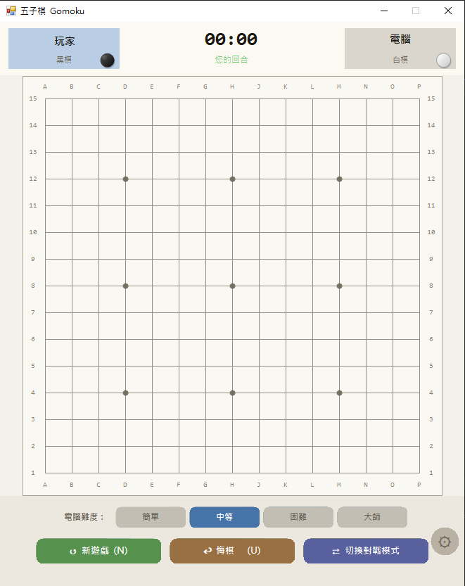

# Gomoku
## 專案簡介
本專案開發了一款具備人機對戰與雙人對戰模式的五子棋遊戲。本系統不僅支援四段可調式 AI 難度與即時悔棋功能，還內建了「Minimax Alpha-Beta 剪枝搜尋演算法」與「流暢動畫棋盤介面」，能主動判斷勝負並標示連線，確保使用者在對戰、切換模式與調整設定時，擁有流暢、直覺且穩定的遊戲體驗。
## 使用者畫面

## 執行說明書與結果判讀
### 操作流程說明
請依序執行以下步驟進行五子棋遊戲：
1. **選擇對戰模式**：點擊「切換對戰模式」按鈕，可在「玩家 vs 電腦」與「玩家 vs 玩家」之間切換。
2. **設定 AI 難度**：在人機對戰模式下，於底部難度列選擇「簡單」、「中等」、「困難」或「大師」，雙人模式下此選項自動停用。
3. **開始落子**：在棋盤上點擊交叉點即可落子，黑棋先行，雙方輪流進行。
4. **判讀勝負結果**：任一方達成五子連線時，系統自動判定勝負並以紅線標示連線位置，上方狀態列同步顯示勝利訊息。
### 功能按鈕與互動操作
* **新遊戲**：清除當前棋盤並重置所有狀態，快捷鍵為 `N`。
* **悔棋**：撤銷上一步落子紀錄，人機模式下會同時撤銷電腦的回應，快捷鍵為 `U`。
* **切換對戰模式**：在人機對戰與雙人對戰之間切換，切換時自動開始新局。
* **難度選擇列**：提供四段 AI 強度調整，雙人對戰模式下自動鎖定為不可操作狀態。
* **設定面板（齒輪圖示）**：點擊右下角齒輪按鈕開啟設定面板，可調整背景音樂音量及切換深色／亮色介面主題。
